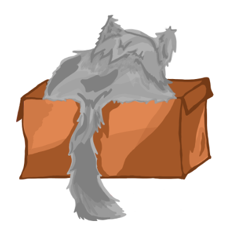

<!-- PROJECT SHIELDS -->
<!--
*** I'm using markdown "reference style" links for readability.
*** Reference links are enclosed in brackets [ ] instead of parentheses ( ).
*** See the bottom of this document for the declaration of the reference variables
*** for contributors-url, forks-url, etc. This is an optional, concise syntax you may use.
*** https://www.markdownguide.org/basic-syntax/#reference-style-links
-->

<!-- PROJECT LOGO -->
<br />
<div align="center">
  <a href="https://github.com/Grupo-Criptografia/LockBox">
    
  </a>

<h3 align="center">Lock-Box</h3>

  <p align="center"><b>
    Start your encryption adventure right now and go beyond theory!
  </b></p>
</div>


<!-- TABLE OF CONTENTS -->
<details>
  <summary>Table of Contents</summary>
  <ol>
    <li>
      <a href="#about-the-project">About The Project</a>
      <ul>
        <li><a href="#built-with">Built With</a></li>
      </ul>
    </li>
    <li>
      <a href="#getting-started">Getting Started</a>
      <ul>
        <li><a href="#prerequisites">Prerequisites</a></li>
        <li><a href="#installation">Installation</a></li>
      </ul>
    </li>
    <li><a href="#usage">Usage</a></li>
    <li><a href="#roadmap">Roadmap</a></li>
    <li><a href="#contributing">Contributing</a></li>
    <li><a href="#license">License</a></li>
    <li><a href="#contact">Contact</a></li>
    <li><a href="#acknowledgments">Acknowledgments</a></li>
  </ol>
</details>


<!-- ABOUT THE PROJECT -->

## About The Project

[![Lock-Box-Main][lock_box-screenshot]](https://example.com)


<p align="right">(<a href="#readme-top">back to top</a>)</p>

### Built With

* [![React][React.js]][React-url]
* [![Tailwindcss][Tailwindcss.js]][Tailwindcss-url]
* [![Django][Django.js]][Django-url]

<p align="right">(<a href="#readme-top">back to top</a>)</p>


<!-- GETTING STARTED -->

## Getting Started

To get a local copy up and running follow these simple example steps.

### Prerequisites

Make sure you have the following requirements installed on your system:

- [Python](https://www.python.org/downloads/) (recommended version: 3.11.4)
- [Node.js](https://nodejs.org/) (recommended version: 20.5.0)

### Installation

1. Clone the repo
   ```sh
   https://github.com/Grupo-Criptografia/LockBox.git
   ```
2. After cloning the repository, navigate to the project directory or open with an IDE.

3. Open a terminal in the project's root directory to Create and Activate a Virtual Environment (venv), run the
   following commands:
    ```sh
   # On Unix or MacOS systems
   python3 -m venv venv-env
   
   # On Windows systems
   python -m venv venv
   or
   py -m venv venv
   
   # Activate the virtual environment
   
   # On Unix or MacOS systems
   source venv-env/bin/activate
   
   # On Windows systems
   source venv/Scripts/activate
   ```

4. Inside the virtual environment, use pip to install Python requirements from the `requirements.txt` file:
   ```sh
   pip install -r requirements.txt
   ```

5. navigate to the folder `lock_box_client`:
    ```sh
   cd lock_box_client
   ```

6. Run the following commands to install Node.js dependencies from the package.json file:
    ```sh
   npm install
   ```
7. To verify that every tool is installed, run this command:
   ```sh
   python -m pip install --upgrade setuptools
   ```
8. To check that the installation was successful run the following commands:
   *  Open a terminal in the **project's root directory** and run:
   ```sh
   # On Unix or MacOS systems
   python3 manage.py runserver
   
   # On Windows systems
   python manage.py runserver
   or
   py manage.py runserver
   ```
    *  Open a other terminal in the project's root directory and run:
   ```sh
   cd lock_box_client

   npm run dev
   ```

<p align="right">(<a href="#readme-top">back to top</a>)</p>


<!-- USAGE EXAMPLES -->

## Usage

Use this space to show useful examples of how a project can be used. Additional screenshots, code examples and demos
work well in this space. You may also link to more resources.

_For more examples, please refer to the [Documentation](https://example.com)_

<p align="right">(<a href="#readme-top">back to top</a>)</p>


<!-- LICENSE -->

## License

Distributed under the MIT License. See `LICENSE.txt` for more information.

<p align="right">(<a href="#readme-top">back to top</a>)</p>


<!-- CONTACT -->

## Contact

Nicolas Alvarez Triana - nialvarezt@unal.edu.co
Nicole Bermudez Santa - labermudezs@unal.edu.co
Sebastian Castro Pardo - jcastropa@unal.edu.co
Sebastian Mendoza Cruz - damendozac@unal.edu.co

Project Link: [https://github.com/Grupo-Criptografia/LockBox](https://github.com/Grupo-Criptografia/LockBox)

<p align="right">(<a href="#readme-top">back to top</a>)</p>


<!-- MARKDOWN LINKS & IMAGES -->
<!-- https://www.markdownguide.org/basic-syntax/#reference-style-links -->

[contributors-shield]: https://img.shields.io/github/contributors/othneildrew/Best-README-Template.svg?style=for-the-badge

[contributors-url]: https://github.com/othneildrew/Best-README-Template/graphs/contributors

[license-shield]: https://img.shields.io/github/license/othneildrew/Best-README-Template.svg?style=for-the-badge

[license-url]: https://github.com/othneildrew/Best-README-Template/blob/master/LICENSE.txt

[product-screenshot]: /lock_box_client/public/screnshootpage.png

[React.js]: https://img.shields.io/badge/React-20232A?style=for-the-badge&logo=react&logoColor=61DAFB

[React-url]: https://reactjs.org/

[Tailwindcss.js]: https://img.shields.io/badge/Tailwindcss-20232A?style=for-the-badge&logo=tailwindcss&logoColor=06B6D4

[Tailwindcss-url]: https://tailwindcss.com

[Django.js]: https://img.shields.io/badge/Django-20232A?style=for-the-badge&logo=django&logoColor=092E20

[Django-url]: https://www.djangoproject.com
